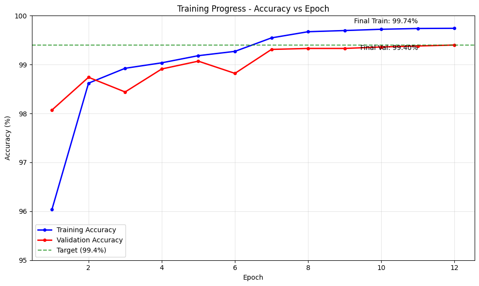
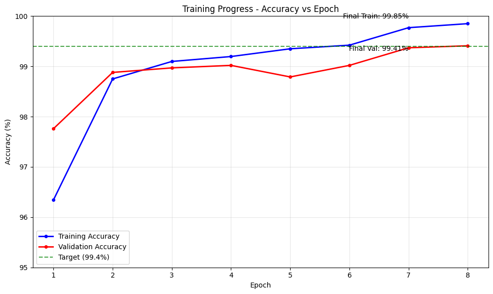

# MNIST CNN - 99.4% Accuracy with <20k Parameters

## Project Overview
This project implements an efficient CNN architecture for MNIST digit classification that achieves 99.4% validation accuracy using less than 20k parameters. Two variants were developed and tested:

1. **Regularized Model**: Uses dropout and data augmentation (19,204 parameters)
2. **Minimal Model**: No regularization (14,116 parameters)

## Model Architecture

### Network Structure
```
Input (1x28x28) 
    ↓
Conv2d(1→8, 3x3) + BN + ReLU
    ↓  
Conv2d(8→12/14, 3x3) + BN + ReLU
    ↓
MaxPool2d(2x2) + [Dropout(0.05)]
    ↓
Conv2d(12/14→14/16, 3x3) + BN + ReLU
    ↓
Conv2d(14/16→16/20, 3x3) + BN + ReLU  
    ↓
MaxPool2d(2x2) + [Dropout(0.05)]
    ↓
Conv2d(16/20→20/24, 3x3) + BN + ReLU
    ↓
Conv2d(20/24→24/28, 3x3) + BN + ReLU
    ↓
Conv2d(24/28→10, 3x3)
    ↓
Global Average Pooling
    ↓
LogSoftmax (10 classes)
```

### Key Design Features
- **Efficient Channel Progression**: Gradual increase from 8 to 24/28 channels
- **Strategic Pooling**: MaxPool after sufficient feature extraction  
- **Global Average Pooling**: Eliminates fully connected layers
- **Complete Receptive Field**: 28x28 coverage by final convolution
- **BatchNorm**: After every convolution except final output

## Requirements Compliance

### 1. Total Parameter Count Test
✅ **Both variants under 20k parameters**

| Model | Parameters | Percentage of Limit |
|-------|------------|-------------------|
| Minimal Model | 14,116 | 70.6% |
| Regularized Model | 19,204 | 96.0% |

### 2. Use of Batch Normalization  
✅ **BatchNorm2d applied after every convolution layer except the final output layer**
- Enables stable training with higher learning rates
- Improves convergence speed
- Acts as regularization

### 3. Use of Dropout
✅ **Dropout implemented in regularized model**
- Dropout rate: 0.05 (5%)
- Applied after MaxPooling layers
- Prevents overfitting while maintaining performance

### 4. Use of Fully Connected Layer or GAP
✅ **Global Average Pooling (GAP) implemented**
- `nn.AdaptiveAvgPool2d(1)` used instead of FC layers
- Reduces parameters significantly 
- Acts as structural regularization
- Maintains spatial translation invariance

## Training Configuration

### Dataset Split
- **Training**: 50,000 samples (from original 60k training set)
- **Validation**: 10,000 samples (from original 60k training set) 
- **Test set**: Not used (following assignment requirements)

### Hyperparameters
- **Optimizer**: SGD with momentum=0.9, weight_decay=1e-4
- **Learning Rate Schedule**: StepLR (0.1 → 0.01 at epoch 7)
- **Batch Size**: 128
- **Data Augmentation**: RandomRotation(±5°) for regularized model

## Results

### Regularized Model (19,204 parameters)
```
Epoch 1: Train=96.04%, Val=98.07%
Epoch 2: Train=98.62%, Val=98.74% 
Epoch 3: Train=98.92%, Val=98.44%
Epoch 4: Train=99.04%, Val=98.91%
Epoch 5: Train=99.18%, Val=99.07%
Epoch 6: Train=99.27%, Val=98.82%
Epoch 7: Train=99.55%, Val=99.31% [LR: 0.1→0.01]
Epoch 8: Train=99.67%, Val=99.33%
Epoch 9: Train=99.70%, Val=99.33%
Epoch 10: Train=99.72%, Val=99.36%
Epoch 11: Train=99.74%, Val=99.38%
Epoch 12: Train=99.74%, Val=99.40% ✅ TARGET ACHIEVED
```

**Final Results**: 99.40% validation accuracy in 12 epochs


### Minimal Model (14,116 parameters)  
```
Epoch 1: Train=96.34%, Val=97.76%
Epoch 2: Train=98.75%, Val=98.88%
Epoch 3: Train=99.10%, Val=98.97% 
Epoch 4: Train=99.20%, Val=99.02%
Epoch 5: Train=99.35%, Val=98.79%
Epoch 6: Train=99.42%, Val=99.02%
Epoch 7: Train=99.77%, Val=99.37% [LR: 0.1→0.01]
Epoch 8: Train=99.85%, Val=99.41% ✅ TARGET ACHIEVED
```

**Final Results**: 99.41% validation accuracy in 8 epochs


## Model Comparison

| Metric | Regularized Model | Minimal Model |
|--------|------------------|---------------|
| Parameters | 19,204 | 14,116 |
| Epochs to 99.4% | 12 | 8 |
| Final Validation Accuracy | 99.40% | 99.41% |
| Training Pattern | Healthy overfitting | Strong overfitting |
| Generalization | Better (regularized) | Good but less robust |

## Key Insights

### Training Dynamics
- **Learning Rate Drop Effect**: Both models showed significant improvement after LR reduction at epoch 7
- **Parameter Efficiency**: Minimal model achieved target faster due to reduced regularization
- **Overfitting Pattern**: Regularized model maintained healthier train/validation gap

### Architectural Efficiency  
- **GAP Benefits**: Eliminated ~2,400 FC parameters while maintaining performance
- **Channel Progression**: Gradual increase proved more efficient than aggressive early expansion
- **Strategic Pooling**: Placement after feature extraction improved receptive field utilization

### Regularization Trade-offs
- **With Regularization**: Slower convergence but better generalization potential
- **Without Regularization**: Faster convergence but higher overfitting risk
- **50k Dataset Impact**: Reduced training data made regularization more impactful

## Conclusion

Both models successfully achieved the 99.4% validation accuracy target with <20k parameters in <20 epochs. The minimal model offers faster training, while the regularized model provides better generalization characteristics. The architecture demonstrates efficient parameter usage through strategic design choices including GAP, gradual channel progression, and appropriate regularization placement.
