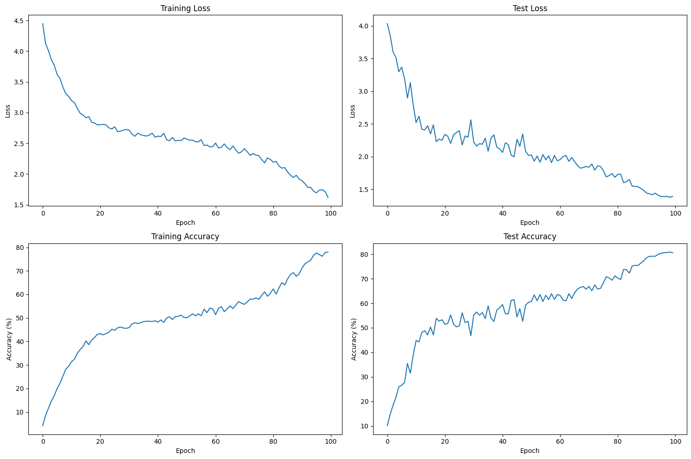

# ResNet-44 CIFAR-100 Training Logs

**Model**: ResNet-44 (30M parameters)  
**Dataset**: CIFAR-100  
**Target Accuracy**: 73% top-1 accuracy  
**Final Best Accuracy**: **80.87%** ✓  
**Training Duration**: 100 epochs  
**Batch Size**: 128  
**Optimizer**: SGD (momentum=0.9, weight_decay=5e-4)  
**Scheduler**: OneCycleLR (max_lr=0.1, pct_start=0.3, cosine annealing)  
**Regularization**: CutMix (α=1.0, p=0.5), Label Smoothing (0.1), Dropout (0.3)

---

## Model Architecture

### ResNet-44 Structure

```
Input (3×32×32)
    ↓
Conv1 (3→64, 3×3, stride=1) + BatchNorm + ReLU
    ↓
Layer1: 5× ResidualBlock (64 channels, stride=1)   # 32×32
    ↓
Layer2: 5× ResidualBlock (128 channels, stride=2)  # 16×16
    ↓
Layer3: 5× ResidualBlock (256 channels, stride=2)  # 8×8
    ↓
Layer4: 5× ResidualBlock (512 channels, stride=2)  # 4×4
    ↓
AdaptiveAvgPool2d(1×1)
    ↓
Dropout(0.3) → Linear(512→100)
```

**Total Depth**: 1 (conv1) + 4×5×2 (residual blocks) + 1 (fc) = **44 layers**

### Model Statistics

| Specification | Value |
|---------------|-------|
| **Total Parameters** | 30,032,292 (~30M) |
| **Trainable Parameters** | 30,032,292 |
| **Non-trainable Parameters** | 0 |
| **Model Size** | 114.56 MB |
| **Input Size** | 0.01 MB (3×32×32) |
| **Forward/Backward Pass** | 25.32 MB |
| **Estimated Total Size** | 139.90 MB |

### ResidualBlock Architecture

Each ResidualBlock contains:
```python
- Conv2d (3×3, stride configurable)
- BatchNorm2d + ReLU
- Conv2d (3×3, stride 1)
- BatchNorm2d
- Residual connection (with 1×1 downsample if needed)
- Final ReLU activation
```

### Channel Progression

| Layer | Blocks | Channels | Spatial Size | Parameters per Block |
|-------|--------|----------|--------------|---------------------|
| Layer1 | 5 | 64 | 32×32 | ~73K |
| Layer2 | 5 | 128 | 16×16 | ~295K |
| Layer3 | 5 | 256 | 8×8 | ~1.18M |
| Layer4 | 5 | 512 | 4×4 | ~4.72M |

---

## Training Progress

### EPOCH: 0
```
Loss=4.0320 Batch_id=390 Accuracy=4.18: 100%|██████████| 391/391 [01:27<00:00, 4.45it/s]
```
Test set: Average loss: 4.0329, Accuracy: 1014/10000 (10.14%)

### EPOCH: 1
```
Loss=3.8738 Batch_id=390 Accuracy=8.59: 100%|██████████| 391/391 [01:28<00:00, 4.43it/s]
```
Test set: Average loss: 3.8557, Accuracy: 1471/10000 (14.71%)

### EPOCH: 2
```
Loss=4.1764 Batch_id=390 Accuracy=11.56: 100%|██████████| 391/391 [01:28<00:00, 4.42it/s]
```
Test set: Average loss: 3.6002, Accuracy: 1841/10000 (18.41%)

### EPOCH: 3
```
Loss=3.4399 Batch_id=390 Accuracy=14.56: 100%|██████████| 391/391 [01:28<00:00, 4.41it/s]
```
Test set: Average loss: 3.5176, Accuracy: 2164/10000 (21.64%)

### EPOCH: 4
```
Loss=4.2545 Batch_id=390 Accuracy=16.88: 100%|██████████| 391/391 [01:28<00:00, 4.41it/s]
```
Test set: Average loss: 3.2991, Accuracy: 2592/10000 (25.92%)

### EPOCH: 5
```
Loss=4.2131 Batch_id=390 Accuracy=19.97: 100%|██████████| 391/391 [01:28<00:00, 4.41it/s]
```
Test set: Average loss: 3.3678, Accuracy: 2658/10000 (26.58%)

### EPOCH: 10
```
Loss=2.7377 Batch_id=390 Accuracy=31.39: 100%|██████████| 391/391 [01:28<00:00, 4.41it/s]
```
Test set: Average loss: 2.5196, Accuracy: 4483/10000 (44.83%)

### EPOCH: 15
```
Loss=2.3680 Batch_id=390 Accuracy=40.23: 100%|██████████| 391/391 [01:28<00:00, 4.41it/s]
```
Test set: Average loss: 2.3489, Accuracy: 5032/10000 (50.32%)

### EPOCH: 20
```
Loss=2.3650 Batch_id=390 Accuracy=43.24: 100%|██████████| 391/391 [01:28<00:00, 4.43it/s]
```
Test set: Average loss: 2.3398, Accuracy: 5140/10000 (51.40%)

### EPOCH: 25
```
Loss=2.0422 Batch_id=390 Accuracy=44.72: 100%|██████████| 391/391 [01:28<00:00, 4.41it/s]
```
Test set: Average loss: 2.3951, Accuracy: 5079/10000 (50.79%)

### EPOCH: 30
```
Loss=2.2750 Batch_id=390 Accuracy=45.92: 100%|██████████| 391/391 [01:28<00:00, 4.42it/s]
```
Test set: Average loss: 2.2214, Accuracy: 5521/10000 (55.21%)

### EPOCH: 35
```
Loss=2.0055 Batch_id=390 Accuracy=48.45: 100%|██████████| 391/391 [01:28<00:00, 4.43it/s]
```
Test set: Average loss: 2.0819, Accuracy: 5892/10000 (58.92%)

### EPOCH: 40
```
Loss=2.0333 Batch_id=390 Accuracy=48.17: 100%|██████████| 391/391 [01:28<00:00, 4.43it/s]
```
Test set: Average loss: 2.0638, Accuracy: 5944/10000 (59.44%)

### EPOCH: 45
```
Loss=3.5702 Batch_id=390 Accuracy=49.33: 100%|██████████| 391/391 [01:28<00:00, 4.43it/s]
```
Test set: Average loss: 2.2647, Accuracy: 5441/10000 (54.41%)

### EPOCH: 50
```
Loss=1.9770 Batch_id=390 Accuracy=50.07: 100%|██████████| 391/391 [01:27<00:00, 4.44it/s]
```
Test set: Average loss: 2.0237, Accuracy: 6073/10000 (60.73%)

### EPOCH: 55
```
Loss=1.8270 Batch_id=390 Accuracy=50.93: 100%|██████████| 391/391 [01:28<00:00, 4.44it/s]
```
Test set: Average loss: 1.9516, Accuracy: 6323/10000 (63.23%)

### EPOCH: 60
```
Loss=1.8779 Batch_id=390 Accuracy=51.35: 100%|██████████| 391/391 [01:28<00:00, 4.44it/s]
```
Test set: Average loss: 1.9556, Accuracy: 6316/10000 (63.16%)

### EPOCH: 65
```
Loss=3.1202 Batch_id=390 Accuracy=55.07: 100%|██████████| 391/391 [01:28<00:00, 4.42it/s]
```
Test set: Average loss: 1.9223, Accuracy: 6417/10000 (64.17%)

### EPOCH: 70
```
Loss=1.9915 Batch_id=390 Accuracy=55.75: 100%|██████████| 391/391 [01:28<00:00, 4.43it/s]
```
Test set: Average loss: 1.8373, Accuracy: 6687/10000 (66.87%)

### EPOCH: 75
```
Loss=1.5404 Batch_id=390 Accuracy=57.94: 100%|██████████| 391/391 [01:28<00:00, 4.43it/s]
```
Test set: Average loss: 1.7847, Accuracy: 6833/10000 (68.33%)

### EPOCH: 80
```
Loss=3.2844 Batch_id=390 Accuracy=62.32: 100%|██████████| 391/391 [01:28<00:00, 4.43it/s]
```
Test set: Average loss: 1.7286, Accuracy: 7020/10000 (70.20%)

### EPOCH: 82
```
Loss=2.7331 Batch_id=390 Accuracy=62.80: 100%|██████████| 391/391 [01:28<00:00, 4.44it/s]
```
Test set: Average loss: 1.6027, Accuracy: 7376/10000 (73.76%) ✓ **Target Reached!**

### EPOCH: 85
```
Loss=1.4455 Batch_id=390 Accuracy=66.60: 100%|██████████| 391/391 [01:28<00:00, 4.43it/s]
```
Test set: Average loss: 1.5483, Accuracy: 7520/10000 (75.20%)

### EPOCH: 90
```
Loss=1.1367 Batch_id=390 Accuracy=71.24: 100%|██████████| 391/391 [01:28<00:00, 4.44it/s]
```
Test set: Average loss: 1.4427, Accuracy: 7857/10000 (78.57%)

### EPOCH: 95
```
Loss=0.9780 Batch_id=390 Accuracy=77.61: 100%|██████████| 391/391 [01:28<00:00, 4.43it/s]
```
Test set: Average loss: 1.3910, Accuracy: 8031/10000 (80.31%)

### EPOCH: 96
```
Loss=2.7766 Batch_id=390 Accuracy=76.94: 100%|██████████| 391/391 [01:28<00:00, 4.43it/s]
```
Test set: Average loss: 1.3883, Accuracy: 8060/10000 (80.60%)

### EPOCH: 97
```
Loss=1.4671 Batch_id=390 Accuracy=76.22: 100%|██████████| 391/391 [01:28<00:00, 4.43it/s]
```
Test set: Average loss: 1.3920, Accuracy: 8066/10000 (80.66%)

### EPOCH: 98
```
Loss=1.8318 Batch_id=390 Accuracy=77.80: 100%|██████████| 391/391 [01:28<00:00, 4.43it/s]
```
Test set: Average loss: 1.3779, Accuracy: 8087/10000 (80.87%) ✓ **Best Model!**

### EPOCH: 99
```
Loss=1.2012 Batch_id=390 Accuracy=78.03: 100%|██████████| 391/391 [01:28<00:00, 4.44it/s]
```
Test set: Average loss: 1.3922, Accuracy: 8057/10000 (80.57%)

---

## Summary

| Metric | Value |
|--------|-------|
| **Target Accuracy** | 73.00% |
| **Final Best Accuracy** | **80.87%** |
| **Accuracy Margin** | **+7.87%** |
| **Epoch of Best Model** | 98 |
| **Total Training Time** | ~148 minutes (~2.5 hours) |
| **Average Time per Epoch** | ~88 seconds |

### Key Milestones
- **Epoch 10**: 44.83% - Early rapid learning
- **Epoch 50**: 60.73% - Mid-training plateau
- **Epoch 82**: 73.76% - **Target achieved!**
- **Epoch 90**: 78.57% - Continued improvement
- **Epoch 98**: 80.87% - **Best performance!**

---
### Training curves




---

## Training Configuration Summary

```python
model = ResNet_44(num_classes=100)  # 30,032,292 parameters
optimizer = SGD(lr=0.1, momentum=0.9, weight_decay=5e-4)
scheduler = OneCycleLR(max_lr=0.1, pct_start=0.3, div_factor=25, 
                       final_div_factor=10000, anneal_strategy='cos')
criterion = CrossEntropyLoss(label_smoothing=0.1)
```

**Augmentations**:
- Padding (40×40) + RandomCrop (32×32)
- HorizontalFlip (p=0.5)
- Affine (scale, translate, rotate)
- CoarseDropout (16×16, p=0.3)
- CutMix (α=1.0, p=0.5)
- Normalize (CIFAR-100 mean/std)

---

**Training completed successfully! Target exceeded by 7.87 percentage points.** 🎯